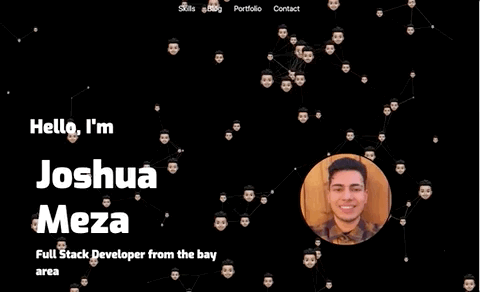
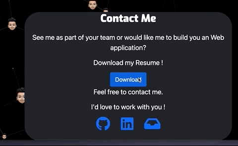
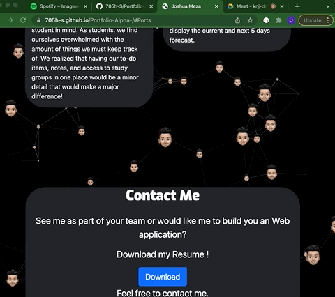

# Portfolio-V3

---

## Table of Contents

- [Built with](#built-with)
- [APIs](#apis-used)
- [Live link](#deployed-link)
- [Functionality](#functionality)
- [Learning points](#learning-points)

---

## Built With

- [HTML](https://developer.mozilla.org/en-US/docs/Web/HTML)
- [CSS](https://developer.mozilla.org/en-US/docs/Web/CSS)
- [Javascript](https://developer.mozilla.org/en-US/docs/Web/JavaScript)

---

## Apis Used

- [Particles.js](https://github.com/VincentGarreau/particles.js)
- [Bootstrap](https://getbootstrap.com/)

---

## Deployed Link

- [Portfolio](https://705h-s.github.io/Portfolio-Alpha-/)

---

## Functionality

### Particles,js

Thanks to the Particles.js library I am able to have animated particles which I can customize as my background. User can also Interact with them.

---

### Nav Links

User can scroll through the page with Nav Links

---

### Resume Download

Users can access my resume in the contact section. Users can download my resume in a .PDF format.

> PDF Format

---

### Mobile response

Users can browse my portfolio on their phones.
The Nav Bar will also adapt to mobile devices.

---

### Contact Information

User can accesss my contact information by clicking on the icons.

---

### Old portfolios to reference too

Here are my old portfolios. As you can see I have improved over the course of a month.

[First Portfolio](https://705h-s.github.io/prework-about-me/)

[secound Portfolio](https://705h-s.github.io/Porfolio-Beta-/)

---

## License

for UC Berkely Extention bootcamp program

### AOS:  

The MIT License (MIT)
Copyright (c) 2015 Michał Sajnóg

### Particles.js:  

© Author : Vincent Garreau - vincentgarreau.com

MIT license: http://opensource.org/licenses/MIT

### Bootstrap:  

Code licensed MIT, docs CC BY 3.0.
Currently v5.1.3.

---

#### Author and App developer - Joshua Meza

[GitHub](https://github.com/705h-S)  
[linkedin](https://www.linkedin.com/in/joshua-meza-918b77224/)
